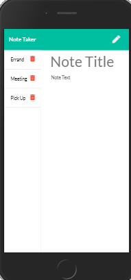
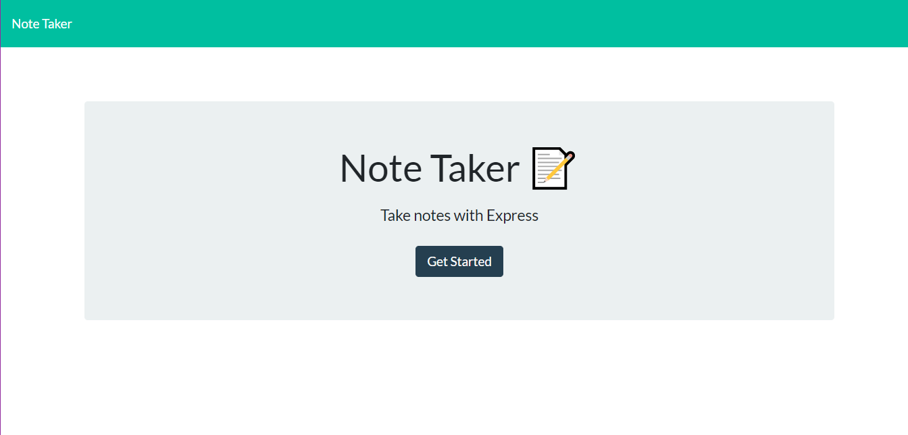

# KCNotetaker
A place to save thoughts and to-dos.

 
 ## Description: 
 An express backend application that dynamically generates a note list. Utilizing user input, notes will be saved until the user deletes.
 
 ## Table of Contents: 
  * Installation 
  * Usage 
  * License 
  * Contributing 
  * Questions 
  * Images 
   
   #### Installation: 

   npm install
   
   ### Usage: 

   As a user, I am always looking for ways to keep track of a lot of information.  This project will provide a resource for readily creating a generating a note list for maintaining written documentation of important items for recall later and eventual deletion when no longer pertinent.
   
   #### License: 

   ISC: 
   
   ### Contributions: Karna Cutolo

   ### Deployed Link:

   https://peaceful-journey-69039.herokuapp.com/   
  
   ### Questions: 
   
   #### If you have any questions about this repo, please reach out: 

   **Email: karna.cutolo@gmail.com**
     
   #### Images: 

   **Responsiveness View - I-Phone 6/7/8**

   

   **Full-Screen View**

   